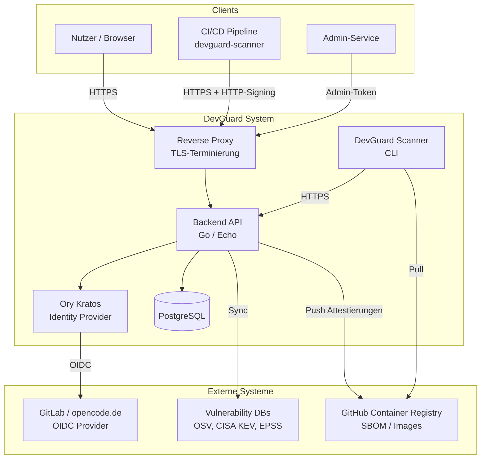
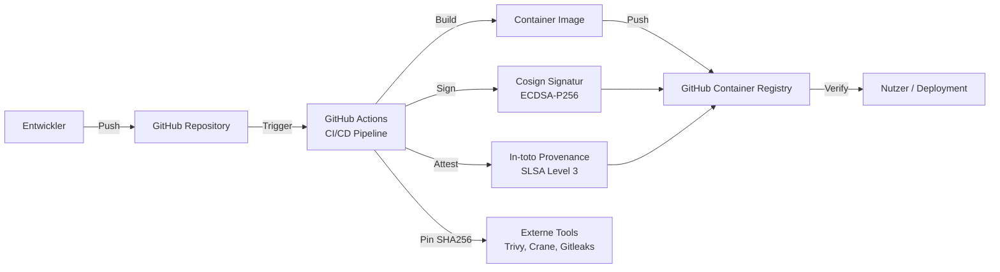

# Threat Model

**Threat Modeling**:

DevGuard wurde nach dem Prinzip „Secure by Design" entwickelt. Das Threat Modeling folgt der **STRIDE-Methodik** (Spoofing, Tampering, Repudiation, Information Disclosure, Denial of Service, Elevation of Privilege).

## Systemübersicht

DevGuard ist eine mehrschichtige Webanwendung mit folgenden Hauptkomponenten:
- **Backend API** (Go/Echo): REST-API für Vulnerability-Management und Compliance
- **Ory Kratos**: Identity Provider für Authentifizierung
- **PostgreSQL**: Datenpersistenz
- **DevGuard Scanner**: CLI-Tool für Sicherheitsscans (läuft in CI/CD-Pipelines)

## STRIDE-Analyse

### S – Spoofing (Identitätsverschleierung)
- **Bedrohung**: Angreifer gibt sich als legitimer Nutzer oder Service aus.
- **Gegenmaßnahmen**:
  - Ory Kratos für sichere Authentifizierung (Session-Cookies, OAuth2/OIDC)
  - HTTP-Request-Signing für Personal Access Tokens (kryptografische Verifikation via `X-Signature`/`X-Fingerprint`)
  - Admin-Token-basierte Service-Authentifizierung
  - OAuth2 State-Parameter und PKCE gegen CSRF

### T – Tampering (Manipulation)
- **Bedrohung**: Manipulation von Daten in Transit oder at Rest (z. B. SBOM-Daten, Scan-Ergebnisse).
- **Gegenmaßnahmen**:
  - TLS für alle Transportverbindungen
  - Cosign-Signaturen für Container-Images und SBOMs
  - In-toto-Attestierungen für die Build-Supply-Chain (SLSA Level 3)
  - SHA256-Prüfsummen für alle Build-Artefakte und externe Tools

### R – Repudiation (Abstreitbarkeit)
- **Bedrohung**: Nutzer oder Angreifer streiten Aktionen ab (z. B. unerlaubte Konfigurationsänderungen).
- **Gegenmaßnahmen**:
  - Strukturiertes Audit-Logging via OpenTelemetry und slog
  - Sentry-Integration für Fehler-Tracking und Anomalieerkennung
  - Cosign-signierte Artefakte als kryptografischer Nachweis des Build-Prozesses

### I – Information Disclosure (Informationsoffenbarung)
- **Bedrohung**: Unberechtigter Zugriff auf Schwachstellendaten, API-Keys oder personenbezogene Daten.
- **Gegenmaßnahmen**:
  - RBAC via Casbin mit Organisation-/Projekt-/Asset-Scoping (Multi-Tenant-Isolation)
  - Kein Klartextspeicherung sensibler Daten (PAT Private Keys verbleiben beim Nutzer)
  - Minimales Container-Image (keine Shell, kein Debug-Tooling in Produktion)
  - Secrets werden ausschließlich als GitHub Secrets verwaltet

### D – Denial of Service (Dienstverweigerung)
- **Bedrohung**: Überlastung der API oder Datenbank durch massenhafte Anfragen.
- **Gegenmaßnahmen**:
  - Rate-Limiting auf Middleware-Ebene
  - Strukturierte Fehlerbehandlung verhindert Panic-basierte Abstürze (getestete Stack-Overflow-Prävention für SBOM-Graphen)
  - Node-Elision-Algorithmus für zyklische SBOM-Abhängigkeitsgraphen

### E – Elevation of Privilege (Privilegienerweiterung)
- **Bedrohung**: Nutzer erlangt Berechtigungen über seine zugewiesene Rolle hinaus.
- **Gegenmaßnahmen**:
  - Casbin RBAC mit Domain-Scoping (Organisations-, Projekt- und Asset-Ebene)
  - Separate Middleware-Schichten für Authentifizierung und Autorisierung
  - Externe RBAC-Provider für Drittanbieter-Integrationen mit eingeschränkten Scopes

## Supply-Chain-Bedrohungen

Als Tool für Software-Supply-Chain-Sicherheit ist DevGuard selbst ein attraktives Angriffsziel:

- **Schutz durch SLSA Level 3**: Provenance-Attestierungen für alle Release-Artefakte
- **Pinned Actions in GitHub CI/CD**: Alle GitHub Actions werden mit spezifischen SHA256-Commit-Hashes gepinnt
- **Signierte Releases**: Container-Images, Binaries und Checksummen werden mit Cosign signiert
- **Vulnerability-Datenbank**: Die eigene Vulnerability-Datenbank wird alle 6 Stunden automatisch synchronisiert (`.github/workflows/vulndb.yaml`)
