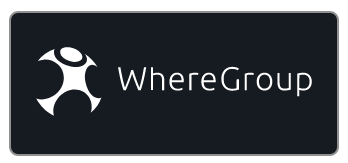

 

  <picture>
    <source srcset="docs/logo_inverse_horizontal.svg"  media="(prefers-color-scheme: dark)">
    
  </picture>

  <h3 align="center">DevGuard — Develop Secure Software</h3>

  

    Open-source vulnerability management for the full software supply chain.
     
    An <a href="https://owasp.org/">OWASP</a> Incubating Project.
     
     
    <a href="https://docs.devguard.org">Documentation</a>
    ·
    <a href="https://main.devguard.org/l3montree-cybersecurity/projects/devguard">Live Demo</a>
    ·
    <a href="https://github.com/l3montree-dev/devguard/issues">Report Bug</a>
    ·
    <a href="https://matrix.to/#/#devguard:matrix.org">Chat (Matrix)</a>
  

   
   
   
   
   
   

---

> [!NOTE]
> Join the monthly [DevGuard Open Community Call](https://meet.mailbox.org/room/dad9052b-7b28-40c8-bf6c-462798a88827?invite=1b3e44cc-2e46-4050-8359-bee002d8bbfe) starting from 23.04.26 - always at 17 pm (UTC+2). Help discussing new features, contributions and the development of the project. 
> For support please check out the [community matrix space](https://matrix.to/#/#devguard:matrix.org).

## What is DevGuard?

DevGuard is an open-source platform that gives development teams full visibility and control over vulnerabilities across their software supply chain — from source code and dependencies to container images and deployed artifacts.

It replaces the patchwork of disconnected scanners, spreadsheets, and manual triage with a single system that **scans, prioritizes, tracks, and documents** security findings across your entire SDLC.

DevGuard is built on open standards exclusively (SBOM, VEX, SARIF, SLSA, in-toto) — no vendor lock-in, no proprietary formats.

## When should I use DevGuard?

Use DevGuard if you need to:

- **Know what's in your software** — automated SBOM generation and dependency tracking across all your projects
- **Find and fix vulnerabilities** — continuous scanning (SCA, SAST, secret scanning, IaC, container scanning) integrated into CI/CD
- **Stop wasting time on noise** — risk-based prioritization that goes beyond raw CVSS scores by factoring in exploitability (EPSS), dependency depth, and your project's CIA assessment
- **Triage at scale** — VEX-based assessment workflows and reusable VEX rules to handle recurring false positives once, not per-project
- **Block malicious packages** — dependency firewall for npm, Go, and Python that checks packages before they enter your codebase
- **Meet compliance requirements** — automated evidence generation for ISO 27001, Cyber Resilience Act (CRA), BSI IT-Grundschutz, and SLSA
- **Share transparency data** — dynamic SBOM and VEX endpoints that stay current, because what's safe today may have a CVE tomorrow

DevGuard is for developers, DevOps engineers, and security teams. You don't need to be a security expert to use it.

## Key Capabilities

| Capability | What it does |
|---|---|
| **Full DevSecOps Pipeline** | Secret scanning, SAST, SCA, IaC scanning, container scanning, license compliance — all from one CLI and CI integration |
| **Risk-Based Prioritization** | Scores vulnerabilities using `(CVSS-BE × (EPSS + 1)) / 2 / Component Depth` so you fix what actually matters first |
| **SBOM & VEX Management** | Works on SBOMs, provides full VEX workflows to document assessments, and serves both via live API endpoints |
| **Dependency Firewall** | Proxies npm, Go, and Python registries — blocks known-malicious and vulnerable packages before download |
| **Supply Chain Integrity** | in-toto attestations, SLSA provenance, cosign signatures, reproducible builds with Nix |
| **Policy Enforcement** | Define organization-wide security policies with OPA/Rego, enforced automatically |
| **Integrations** | GitHub, GitLab, Jira — scan results as issue |

## Talks & Presentations

To understand the principles behind DevGuard, watch these conference talks:

- **FOSDEM 2026** — *Securing Software for the Public Sector* — [Watch the recording](https://ftp.belnet.be/mirror/FOSDEM/video/2026/aw1120/NK3MJY-securing-software-for-the-public-sector.mp4)
- **FrOSCon 2025** — *Develop Secure Software — The DevGuard Project* — [Watch the recording](https://media.ccc.de/v/froscon2025-3322-develop_secure_software_-_the_devguard_project)

## Getting Started

The full documentation lives at **[docs.devguard.org](https://docs.devguard.org)**. It covers installation, quickstart, CI/CD integration, scanner usage, and configuration.

For details on connecting to your CI, setting up the dependency firewall, or self-hosting in production, see the [documentation](https://docs.devguard.org).

## Live Demo

We use DevGuard to scan DevGuard itself. Browse the live instance to see real vulnerability data, SBOMs, and VEX assessments:

**[main.devguard.org/l3montree-cybersecurity/projects/devguard](https://main.devguard.org/l3montree-cybersecurity/projects/devguard)**

Live SBOM and VEX data for this project:

| Component | SBOM | VEX |
|---|---|---|
| [Backend (this repo)](https://github.com/l3montree-dev/devguard) | [SBOM](https://api.main.devguard.org/api/v1/public/e1f24270-6e68-4571-9168-9c151c639c97/refs/main/artifacts/pkg%3Aoci%2Fdevguard%3Frepository_url%3Dghcr.io%2Fl3montree-dev%2Fdevguard%26arch%3Damd64%26tag%3Dmain-amd64/sbom.json/) | [VEX](https://api.main.devguard.org/api/v1/public/e1f24270-6e68-4571-9168-9c151c639c97/refs/main/artifacts/pkg%3Aoci%2Fdevguard%3Frepository_url%3Dghcr.io%2Fl3montree-dev%2Fdevguard%26arch%3Damd64%26tag%3Dmain-amd64/vex.json/) |
| [Web Frontend](https://github.com/l3montree-dev/devguard-web) | [SBOM](https://api.main.devguard.org/api/v1/public/169319b7-8170-469f-9e31-f87b6054e507/refs/main/artifacts/pkg%3Aoci%2Fdevguard-web%3Frepository_url%3Dghcr.io%2Fl3montree-dev%2Fdevguard-web%26arch%3Damd64%26tag%3Dmain-amd64/sbom.json/) | [VEX](https://api.main.devguard.org/api/v1/public/169319b7-8170-469f-9e31-f87b6054e507/refs/main/artifacts/pkg%3Aoci%2Fdevguard-web%3Frepository_url%3Dghcr.io%2Fl3montree-dev%2Fdevguard-web%26arch%3Damd64%26tag%3Dmain-amd64/vex.json/) |

## Architecture

DevGuard consists of two projects:

- **Backend** (this repo) — Go API server and PostgreSQL
- **Frontend** — [devguard-web](https://github.com/l3montree-dev/devguard-web) — Next.js web application

## Contributing

Contributions are welcome. Read the [contribution guide](./CONTRIBUTING.md) to get started, or pick up a [help wanted](https://github.com/l3montree-dev/devguard/issues?q=is%3Aopen+is%3Aissue+label%3A%22help+wanted%22) issue.

Please follow the [Code of Conduct](CODE_OF_CONDUCT.md).

## License

AGPL-3.0-or-later. See [LICENSE.txt](LICENSE.txt).

## Sponsors and Supporters

