

  <a href="https://devguard.org">
    <picture>
      <source srcset="docs/logo_inverse_horizontal.svg"  media="(prefers-color-scheme: dark)">
      
  </picture>
  </a>

<h3 align="center">Open-source vulnerability management for the full software supply chain</h3>

  An <a href="https://owasp.org/www-project-devguard/">OWASP Incubating Project</a> · Made in Germany 🇩🇪 for the world 🌍

  <a href="https://docs.devguard.org">Documentation</a>
  ·
  <a href="https://main.devguard.org/l3montree-cybersecurity/projects/devguard">Live Demo</a>
  ·
  <a href="https://github.com/l3montree-dev/devguard/issues">Report Bug</a>
  ·
  <a href="https://matrix.to/#/#devguard:matrix.org">Chat (Matrix)</a>

  
  
  
  
  
  

> [!NOTE]
> Join the monthly [DevGuard Open Community Call](https://meet.mailbox.org/room/dad9052b-7b28-40c8-bf6c-462798a88827?invite=1b3e44cc-2e46-4050-8359-bee002d8bbfe) — always at 17:00 (UTC+2). Help shape new features and discuss contributions. For support, join the [community Matrix space](https://matrix.to/#/#devguard:matrix.org).

---

## What is DevGuard?

**DevGuard is a single platform that finds, prioritizes, and tracks vulnerabilities across your entire software supply chain** — from source code and third-party dependencies to container images, infrastructure-as-code, and deployed artifacts.

It replaces the patchwork of disconnected scanners, spreadsheets, and manual triage with one system that **scans, prioritizes, tracks, and documents** security findings across the whole SDLC. DevGuard is built exclusively on open standards — SBOM, VEX, SARIF, SLSA, in-toto — so there's no vendor lock-in and no proprietary formats.

> This repository contains the **DevGuard Backend** (Go API + PostgreSQL). The web frontend lives at [l3montree-dev/devguard-web](https://github.com/l3montree-dev/devguard-web).

[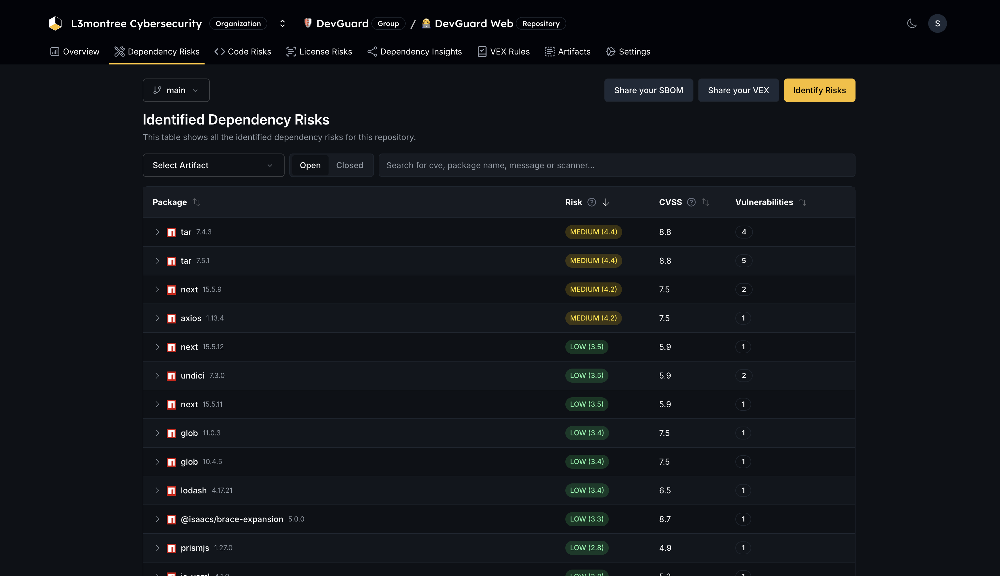](docs/screenshots/dependency-risks.png)

## Why DevGuard?

Traditional security tools treat vulnerability management as something separate from development — generating 50–80% false-positive noise, living in spreadsheets, and demanding context switches from engineers who just want to ship. DevGuard flips that: security intelligence is delivered where developers already work (pull requests, CI, issue trackers), and real risks surface first thanks to multi-dimensional scoring.

Use DevGuard if you need to:

- **Know what's in your software** — automated SBOM generation and dependency tracking across all projects.
- **Find vulnerabilities continuously** — SCA, SAST, secret scanning, IaC, container scanning, and license compliance, all from one CLI.
- **Cut through the noise** — risk-based prioritization using CVSS + EPSS + component depth + your CIA assessment, not raw CVSS alone.
- **Triage at scale** — VEX-based assessment workflows and reusable VEX rules to handle recurring false positives once, not per project.
- **Block malicious packages** — Dependency Firewall for npm, Go, and Python that checks packages before they enter your codebase.
- **Meet compliance requirements** — automated evidence for ISO 27001, Cyber Resilience Act (CRA), BSI IT-Grundschutz, and SLSA.
- **Share transparency data** — live SBOM and VEX endpoints that stay current, because a dependency safe today can have a CVE tomorrow.

DevGuard is for developers, DevOps engineers, and security teams. No specialized security knowledge required.

[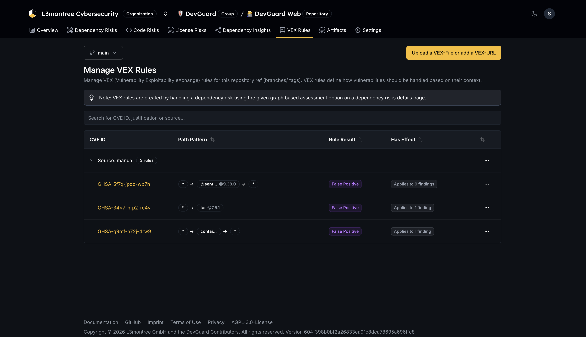](docs/screenshots/vex-rules.png)

## Key Capabilities

| Capability | What it does |
| --- | --- |
| **Full DevSecOps pipeline** | Secret scanning, SAST, SCA, IaC scanning, container scanning, and license compliance — one CLI, one CI integration |
| **Risk-based prioritization** | Scores every finding as `(CVSS-BE × (EPSS + 1)) / 2 / Component Depth` so you fix what actually matters first |
| **SBOM & VEX management** | CycloneDX SBOMs, full VEX workflows, and **live** SBOM/VEX endpoints that always reflect current state |
| **Dependency Firewall** | Proxies npm, Go, and Python registries — blocks known-malicious and vulnerable packages before download |
| **Supply-chain integrity** | in-toto attestations, SLSA provenance, cosign signatures, reproducible builds with Nix |
| **Policy enforcement** | Organization-wide security policies written in OPA/Rego, enforced automatically |
| **Bring your own scanner** | Ingests SBOM (CycloneDX) and SARIF from Trivy, Grype, Semgrep, and any standards-compliant tool |
| **Issue tracker integration** | GitHub Issues, GitLab Issues, and Jira — bidirectional sync with slash-command triage |

[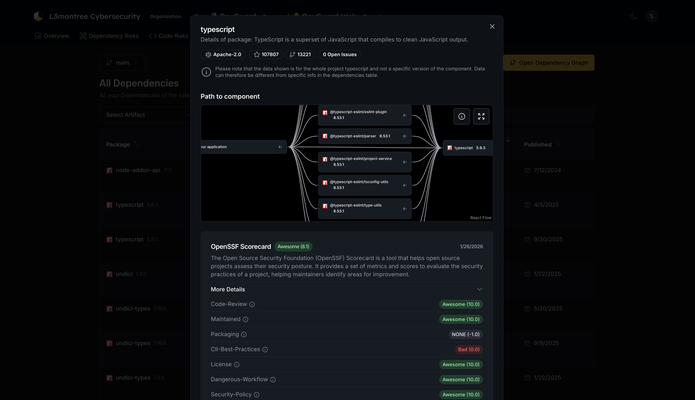](docs/screenshots/dependency-insights.png)

[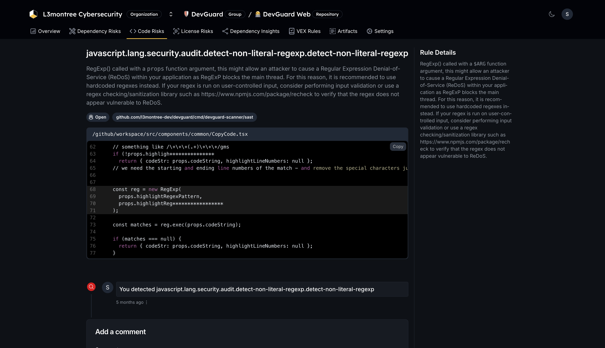](docs/screenshots/code-risks.png)

## Getting started

The full documentation lives at **[docs.devguard.org](https://docs.devguard.org)**. It covers installation, quickstart, CI/CD integration, scanner usage, and configuration.

For details on connecting to your CI, setting up the dependency firewall, or self-hosting in production, see the [documentation](https://docs.devguard.org).

## Documentation

The full documentation lives at **[docs.devguard.org](https://docs.devguard.org)**. Start here:

- 🚀 [Quickstart](https://docs.devguard.org/getting-started) — spin up DevGuard and run your first scan
- 🧠 [Key Concepts in 2 minutes](https://docs.devguard.org/getting-started/key-concepts) — organizations, groups, assets, artifacts
- 📊 [Risk Calculation](https://docs.devguard.org/explanations/core-concepts/risk-scoring) — how findings are scored and prioritized
- 🛡️ [Dependency Firewall](https://docs.devguard.org/how-to-guides/security/dependency-proxy) — block malicious packages before they reach your code
- ✅ [CRA Compliance](https://devguard.org/cra_compliance) — what DevGuard covers under the EU Cyber Resilience Act

## Live Demo

We scan DevGuard with DevGuard. Browse the public instance to see real vulnerability data, SBOMs, and VEX assessments on a live project:

**[main.devguard.org/l3montree-cybersecurity/projects/devguard](https://main.devguard.org/l3montree-cybersecurity/projects/devguard)**

Live (always-current) SBOM and VEX endpoints for this project:

| Component | SBOM | VEX |
| --- | --- | --- |
| [Backend (this repo)](https://github.com/l3montree-dev/devguard) | [SBOM](https://api.main.devguard.org/api/v1/public/e1f24270-6e68-4571-9168-9c151c639c97/refs/main/artifacts/pkg%3Aoci%2Fdevguard%3Frepository_url%3Dghcr.io%2Fl3montree-dev%2Fdevguard%26arch%3Damd64%26tag%3Dmain-amd64/sbom.json/) | [VEX](https://api.main.devguard.org/api/v1/public/e1f24270-6e68-4571-9168-9c151c639c97/refs/main/artifacts/pkg%3Aoci%2Fdevguard%3Frepository_url%3Dghcr.io%2Fl3montree-dev%2Fdevguard%26arch%3Damd64%26tag%3Dmain-amd64/vex.json/) |
| [Web Frontend](https://github.com/l3montree-dev/devguard-web) | [SBOM](https://api.main.devguard.org/api/v1/public/169319b7-8170-469f-9e31-f87b6054e507/refs/main/artifacts/pkg%3Aoci%2Fdevguard-web%3Frepository_url%3Dghcr.io%2Fl3montree-dev%2Fdevguard-web%26arch%3Damd64%26tag%3Dmain-amd64/sbom.json/) | [VEX](https://api.main.devguard.org/api/v1/public/169319b7-8170-469f-9e31-f87b6054e507/refs/main/artifacts/pkg%3Aoci%2Fdevguard-web%3Frepository_url%3Dghcr.io%2Fl3montree-dev%2Fdevguard-web%26arch%3Damd64%26tag%3Dmain-amd64/vex.json/) |

## Talks & Presentations

- **FOSDEM 2026** — *Securing Software for the Public Sector* — [Recording](https://ftp.belnet.be/mirror/FOSDEM/video/2026/aw1120/NK3MJY-securing-software-for-the-public-sector.mp4)
- **FrOSCon 2025** — *Develop Secure Software — The DevGuard Project* — [Recording](https://media.ccc.de/v/froscon2025-3322-develop_secure_software_-_the_devguard_project)

## Community & Contributing

- 💬 **Chat:** [Matrix space](https://matrix.to/#/#devguard:matrix.org)
- 💡 **Discussions:** [GitHub Discussions](https://github.com/l3montree-dev/devguard/discussions)
- 🐛 **Bugs / feature requests:** [GitHub Issues](https://github.com/l3montree-dev/devguard/issues)
- 📅 **Monthly community call:** see the note at the top of this README
- 👷 **Contribute:** read the [contribution guide](CONTRIBUTING.md) and pick up a [help wanted](https://github.com/l3montree-dev/devguard/issues?q=is%3Aopen+is%3Aissue+label%3A%22help+wanted%22) issue

Please follow the [Code of Conduct](CODE_OF_CONDUCT.md) when participating.

## License

DevGuard is licensed under **AGPL-3.0-or-later**. See [LICENSE.txt](LICENSE.txt).

## Sponsors & Supporters

  <a href="https://owasp.org/">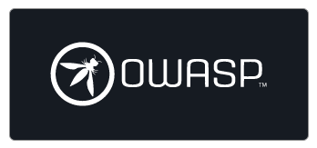</a>
  <a href="https://www.zendis.de/">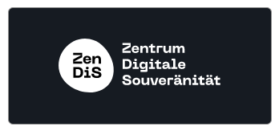</a>
  <a href="https://www.h-brs.de/">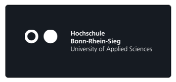</a>
  <a href="https://wheregroup.com/">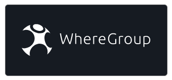</a>
  
  
  
  
  
  <a href="https://business-code.de/">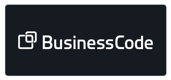</a>
  <a href="https://www.cps-it.de/">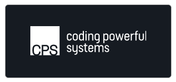</a>
  <a href="https://www.cronn.de/">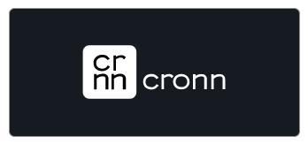</a>
  
  <a href="https://opencode.de/de">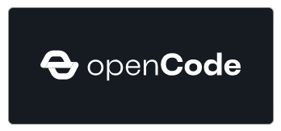</a>
  <a href="https://www.opendesk.eu/de">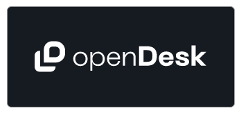</a>

